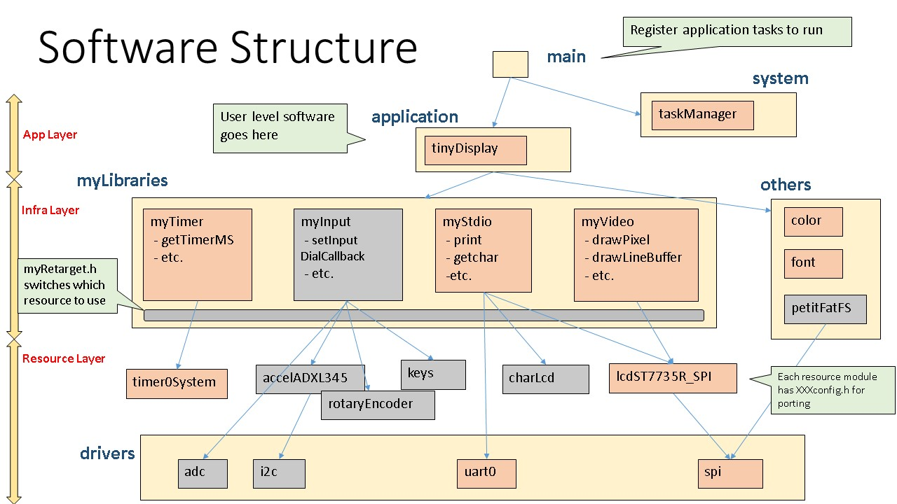

# Tiny Second Display

This is a very tiny display to clone your PC screen.

Link to youtube is bellow:  
[](http://www.youtube.com/watch?v=grzDsh2M5ko)


## Environment
* Atmel Studio 7.0

## Devices
* ATmega328P (not arduino)
* ST7735R Display

## PC Side
### Software needed
* python 2.7.x

### Install Libraries
* pip install PIL
* pip install pyserial
* pip install pyautogui

### How to Run
%> python tinyDisplayServer.py

### Note
* UART Baudrate is 2,000,000 bps


## Software Structure



## Portmap
```
## IO

PORTA0 = 
PORTA1 = 
PORTA2 = 
PORTA3 = 
PORTA4 = 
PORTA5 = 
PORTA6 = 
PORTA7 = 
PORTB0 = 
PORTB1 = LCD_ST7735_DC
PORTB2 = LCD_ST7735_CS
PORTB3 = LCD_ST7735_MOSI
PORTB4 = 
PORTB5 = LCD_ST7735_SCK
PORTB6 = 
PORTB7 = 
PORTC0 = CHAR_LCD_D4 : OUT
PORTC1 = CHAR_LCD_D5 : OUT
PORTC2 = CHAR_LCD_D6 : OUT
PORTC3 = CHAR_LCD_D7 : OUT
PORTC4 = CHAR_LCD_EN : OUT
PORTC5 = CHAR_LCD_RS : OUT
PORTC6 = 
PORTC7 = 
PORTD0 = RX : IN
PORTD1 = TX : OUT
PORTD2 = FATFS_MMC_MISO
PORTD3 = FATFS_MMC_MOSI
PORTD4 = FATFS_MMC_CK
PORTD5 = FATFS_MMC_CS
PORTD6 = 
PORTD7 = 


## Function

USART0 = COM
TIMER0 = System Timer (1msec)
TIMER1 = 
SIO = LCD_ST7735
```